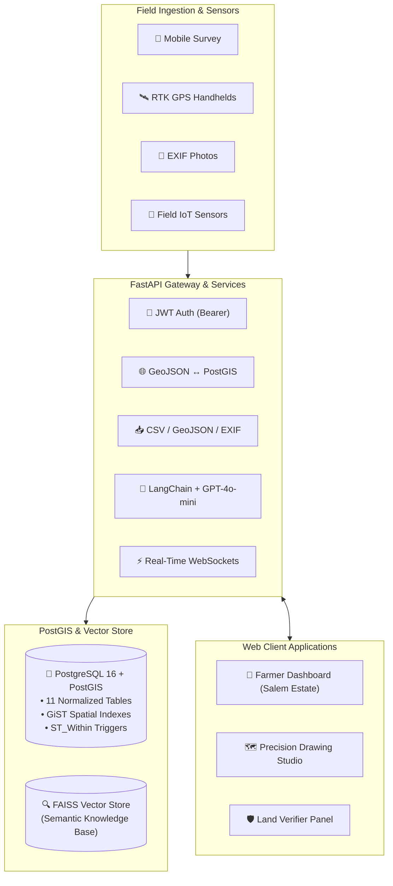

# 🌾 V2V AgriMap DSP — Digital Land & Systems Platform
> **Vision To Value (V2V Tech)** — Precision Agricultural Intelligence, Spatial Digital Twinning, and Infrastructure Pre-Assessment Platform.

<div align="center">
  
  <br/>
  <b>V2V Agrilythos (AGX) Smart Agriculture Initiative</b>
</div>

<br/>

[](https://fastapi.tiangolo.com)
[](https://postgis.net)
[](https://reactjs.org)
[](https://tailwindcss.com)
[](https://leafletjs.com)
[](https://openai.com)

---

## 📖 Table of Contents
- [Executive Overview](#-executive-overview)
- [System Architecture](#-system-architecture)
- [Key Features & Capabilities](#-key-features--capabilities)
- [Precision Drawing Studio (Pipelines, Roads, Fences)](#-precision-drawing-studio)
- [Project Directory Structure](#-project-directory-structure)
- [Quick Start Guide](#-quick-start-guide)
- [V2V Tech Visual Identity & Brand System](#-v2v-tech-visual-identity--brand-system)
- [API Reference & Technical Specification](#-api-reference--technical-specification)
- [License & Credits](#-license--credits)

---

## 🎯 Executive Overview

**AgriMap DSP** is the foundational spatial data and pre-assessment engine for the **V2V Agrilythos (AGX)** smart agriculture initiative.

Before deploying autonomous drone seeding, smart variable-rate irrigation solenoids, or automated soil treatment robots, farmland must be accurately digitized and assessed. AgriMap DSP bridges physical field realities with high-precision GIS and real-time IoT hardware telemetry.

### Core Capabilities:
- **Centimeter-Accurate Farmland Digital Twins**: WGS 84 (EPSG:4326) PostGIS spatial geometries for farm plots, internal crop zones, and field benchmarks.
- **Precision Line & Boundary Drawing Studio**: Interactive map tools to trace and customize irrigation pipelines, tractor roads, perimeter fences, and parcel dividers with dynamic length measurements.
- **Decoupled High-Frequency IoT Telemetry**: MQTT and WebSocket pipelines streaming soil moisture, pH, temperature, and NPK metrics without bloating cartographic datasets.
- **GenAI Agronomic Feasibility Engine**: Automated scoring (1 to 10) combining deterministic rules and LangChain + GPT-4o-mini RAG analysis for water, power, and topography readiness.

---

## 🏗️ System Architecture



---

## ✨ Key Features & Capabilities

| Feature | Description |
|---|---|
| 🛰️ **Satellite Farmland Twin** | High-resolution satellite imagery mapped to real-world farmland coordinates (e.g. Ganesh V.'s farm in Salem, Tamil Nadu). |
| 📏 **Precision Line Studio** | Draw pipelines, roads, and fences with real-time metric/imperial geodesic distance readouts and custom stroke thickness/color. |
| 🏷️ **Interactive Line Inspector** | Click any plotted line on the map to rename, change colors, adjust styles, review distance, or delete the segment. |
| 📊 **Real-Time IoT Telemetry** | Live telemetry tiles showing soil moisture (%), temperature (°C), pH, and NPK nitrogen (mg/kg). |
| 🧠 **AI Farm Feasibility Scoring** | 1 to 10 readiness score evaluating water proximity, electrical grid access, and topographical soil risks. |
| 🔐 **Role-Based Portals** | 1-click demo access for Farmer (Ganesh V.), Administrator, and Field Surveyor. |
| 📥 **Multi-Format Ingestion** | Bulk upload CSV records, GeoJSON feature collections, and GPS-tagged field photos (automatic EXIF extraction). |

---

## 🎨 Precision Drawing Studio

The Drawing Studio in the **Farmer Dashboard** (`/farmer`) enables farmers and surveyors to plot agricultural infrastructure directly over satellite imagery:

- **Line Categories**:
  - 💧 **Irrigation Pipeline**: Blue/Cyan conduits connecting wells to drip networks.
  - 🚜 **Tractor Road**: Amber/Orange access routes for agricultural machinery.
  - 🌿 **Parcel Divider**: Emerald green borders separating crop blocks.
  - 🛡️ **Perimeter Fence**: High-visibility boundaries securing field edges.
  - ⚡ **Power Route**: Electric violet lines tracking utility lines to pump motors.
  - ✏️ **Custom Line**: Freeform multi-point paths.
- **Stroke Customization**:
  - 8-color V2V palette swatches (Royal Purple, Electric Violet, Emerald, Cyan, Amber, Crimson, White).
  - 5 stroke thickness presets (Thin 2px, Normal 4px, Bold 6px, Heavy 8px, Ultra 12px) + continuous slider (2px–16px).
  - 3 line styles: Solid, Dashed, and Dotted.
- **Geodesic Measurement Engine**:
  - Dynamically calculates accurate ellipsoidal path distances in both meters (`m`) and feet (`ft`).

---

## 📁 Project Directory Structure

```
AgriMap DSP/
├── backend/                       # FastAPI Backend Engine (Python 3.10+)
│   ├── app/
│   │   ├── api/v1/                # 17 REST API Routers (~70+ endpoints)
│   │   │   ├── auth.py            # JWT Authentication & tokens
│   │   │   ├── fields.py          # Field boundary CRUD & verification
│   │   │   ├── resources.py       # Water, power, and irrigation assets
│   │   │   ├── devices.py         # IoT device registry & telemetry
│   │   │   ├── ai.py              # GenAI readiness & RAG endpoints
│   │   │   ├── websocket.py       # Real-time WebSocket connection hub
│   │   │   └── ...                # farmers, projects, zones, photos, etc.
│   │   ├── core/                  # Security, database config, and settings
│   │   ├── db/                    # Session factory, migrations, seed data
│   │   ├── models/                # SQLAlchemy ORM models (11 PostGIS tables)
│   │   ├── schemas/               # Pydantic v2 validation schemas
│   │   └── services/              # Ingestion (CSV, GeoJSON, EXIF), AI & IoT
│   ├── Dockerfile                 # Backend container image definition
│   └── requirements.txt           # Python backend dependencies
│
├── frontend/                      # React 18 + Vite GIS Web Application
│   ├── public/                    # Static assets & optimized V2V brand icons
│   │   └── images/
│   │       ├── v2v-icon.png       # Transparent 3D glossy bulb icon
│   │       └── v2v-logo-full.png  # High-res horizontal brand logo
│   ├── src/
│   │   ├── components/            # UI components (V2VLogo, MapViewer, etc.)
│   │   ├── pages/                 # Full application pages
│   │   │   ├── LoginPage.jsx      # Portal with 1-click role selection
│   │   │   ├── RegisterPage.jsx   # Registration with password toggle
│   │   │   ├── FarmerDashboardPage.jsx # Precision Drawing Studio & Telemetry
│   │   │   ├── AdminLandEditorPage.jsx # Verifier & Land Management
│   │   │   └── MapViewPage.jsx    # Satellite GIS canvas
│   │   ├── services/              # API clients & LocalStorage persistence
│   │   └── index.css              # V2V brand theme tokens & hover animations
│   ├── package.json               # Frontend dependencies & Vite scripts
│   └── tailwind.config.js         # V2V color palette definitions
│
├── docs/                          # Comprehensive Documentation
│   └── V2V_AGRIMAP_DSP_MASTER_SPECIFICATION.md # Master Technical Blueprint
│
├── docker-compose.yml             # Orchestration for PostgreSQL/PostGIS & FastAPI
└── README.md                      # Executive Project Documentation
```

---

## 🚀 Quick Start Guide

### Option 1: Docker Compose (Full Stack)
```bash
# Clone the repository and enter directory
cd "c:\V2V Tech\AgriMap DSP"

# Start the PostgreSQL + PostGIS database and FastAPI server
docker-compose up -d

# Verify container health
docker ps
```
- **Backend API**: `http://localhost:8000`
- **Interactive Swagger Docs**: `http://localhost:8000/docs`

---

### Option 2: Frontend Development Server
```bash
# Navigate to frontend directory
cd frontend

# Install node dependencies
npm install

# Start development server
npm run dev
```
- **Web App**: `http://localhost:5173`

backend 
cd backend
docker-compose up -d

---

### 🔑 Pre-Configured Demo Accounts
| Role | Email / Identifier | Password | Access Highlights |
|---|---|---|---|
| **Farmer** | `farmer.ganesh@v2vtech.com` | `farmer123` | Farmland Twin, Drawing Studio, Live Telemetry |
| **Admin** | `admin@agrimap.local` | `admin123` | System Settings, User CRUD, Audit Controls |
| **Surveyor** | `surveyor@agrimap.local` | `surveyor123` | Boundary Digitization, Geotagged Photo Upload |

---

## 🎨 V2V Tech Visual Identity & Brand System

Designed strictly following the official **V2V Tech Brand Style Guide & Color System**:

| Brand Swatch | Hex Code | Purpose & Application |
|---|---|---|
| **Primary Deep Purple** | `#2A0C58` | Headers, navigation bar, hero branding, key identity elements |
| **Dark Purple** | `#3C1775` | Primary action buttons, active states, highlights, map pins |
| **Violet** | `#5E4678` | Secondary UI components, interactive cards, status badges |
| **Purple / Light Purple** | `#8A57C0` | Links, icons, hover effects, interactive borders |
| **Lavender** | `#B890F9` | Soft background elements, background shapes, tags |
| **Light Lavender** | `#D9C7FF` | Subtle highlights, badges, active indicator chips |
| **Soft Gray / Border** | `#E4DFEB` | Section backgrounds, card borders, subtle dividers |
| **Light Background** | `#F4F3F9` | Clean page backgrounds, content card interiors |
| **Near Black / Dark** | `#131313` | Dark sections, footer backdrops, dark mode contrast |
| **Crisp White** | `#FFFFFF` | Main typography on dark surfaces, clean card surfaces |

### Official Gradient Combinations:
- **Primary Gradient**: `#2A0C58` &rarr; `#8A57C0` (Navigation headers, brand CTA buttons)
- **Soft Gradient**: `#3C1775` &rarr; `#B890F9` (Data visualization highlights, feature chips)
- **Dark Gradient (Hero)**: `#131313` &rarr; `#3C1775` (Hero background cards, satellite sidebars)
- **Light Gradient (Sections)**: `#5E4678` &rarr; `#D9C7FF` (Section separators, telemetry cards)

### Decorative Patterns & Charts:
- **Background Patterns**: Wave pattern, Circuit pattern, Hexagon pattern, Dot pattern.
- **Data Visualizations**: High-contrast purple themed Donut charts (75% completed), metric progress bars, and line/bar telemetry.

---

## 🗺️ 'Start From Scratch' Land Boundary & Sub-Field Crop Studio

- **GPS Boundary Digitization from Scratch**: Seamlessly search any place or agricultural hub in India, sequentially collect boundary corner points ("collect, collect") over high-resolution satellite imagery, with live spherical geodesic area (Acres/Ha) and perimeter (Meters/Feet) calculations.
- **Sub-Field & Crop Partitioning**: Create and customize individual internal plots inside the farmland boundary for different crops (Mango Orchard, Bt Cotton, Sugarcane, Basmati Paddy, Banana Plantation, Groundnut, Vegetables) with individual color tagging, growth stage tracking, and micro-irrigation management.

---

## 📚 API Reference & Technical Specification

For the complete technical blueprint, including:
- The **11-table PostGIS schema** and spatial triggers
- The complete **17-router REST and WebSocket API matrix**
- The **GenAI RAG query engine** specifications
- Ingestion pipelines for **CSV, GeoJSON, and Photo EXIF**

Please refer to the master document:  
👉 [`docs/V2V_AGRIMAP_DSP_MASTER_SPECIFICATION.md`](docs/V2V_AGRIMAP_DSP_MASTER_SPECIFICATION.md)

---

## 📄 License & Credits

- **Organization**: V2V Tech — Vision To Value Technologies
- **Platform**: V2V Agrilythos (AGX) Smart Agriculture Initiative
- **Project Lead / Mentorship**: Bavanies
- **Development**: AgriMap DSP Engineering Team (Ravi, Kishore, Ram Prasath)

