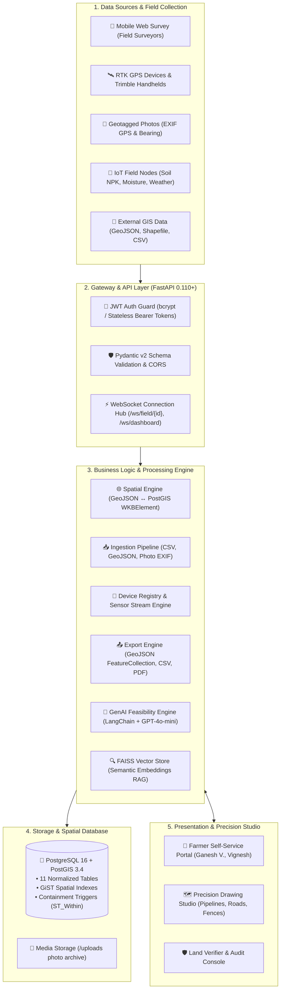
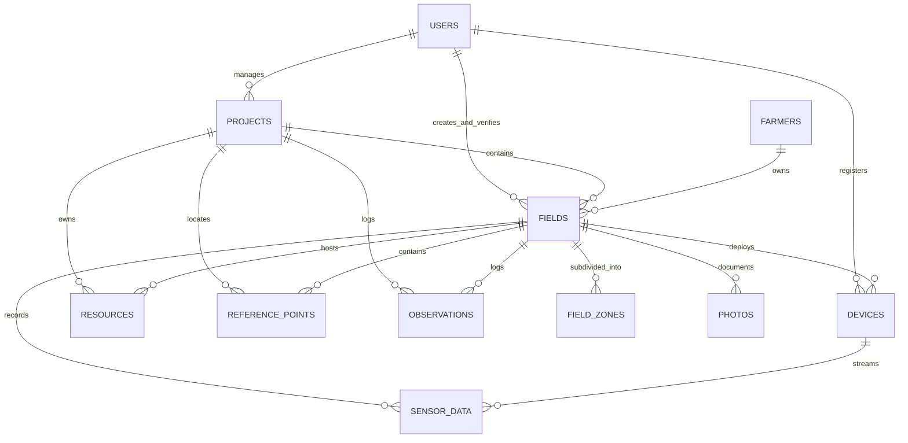
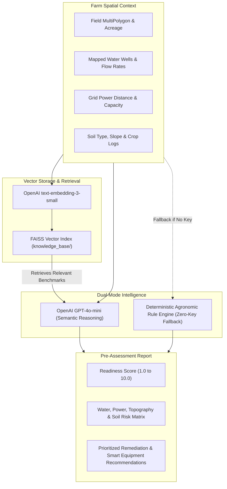

# 🌾 V2V AgriMap DSP — Master System Specification & Technical Blueprint
**V2V Agrilythos (AGX) Digital Land & Systems Platform**  
*Comprehensive End-to-End Architecture, PostGIS Database, Multi-Format Ingestion, IoT Telemetry, GenAI RAG Engine & Precision Satellite Studio*

---

## 📑 Table of Contents
1. [Executive Summary & Domain Context](#1-executive-summary--domain-context)
2. [End-to-End System Architecture](#2-end-to-end-system-architecture)
3. [Data Flow Pipelines (Collection to Analytics)](#3-data-flow-pipelines)
4. [Database Architecture & PostGIS Schema (11 Tables)](#4-database-architecture--postgis-schema)
5. [Backend Services & Core Ingestion Engine](#5-backend-services--core-ingestion-engine)
6. [IoT Telemetry, MQTT & WebSocket Layer](#6-iot-telemetry-mqtt--websocket-layer)
7. [GenAI & RAG Agronomic Intelligence Engine](#7-genai--rag-agronomic-intelligence-engine)
8. [Precision Map Studio & Frontend Architecture](#8-precision-map-studio--frontend-architecture)
9. [Complete API Reference Matrix (17 Routers, ~70+ Endpoints)](#9-complete-api-reference-matrix)
10. [V2V Tech Design System & Brand Identity](#10-v2v-tech-design-system--brand-identity)
11. [DevOps, Deployment & Verification](#11-devops-deployment--verification)

---

## 1. Executive Summary & Domain Context

**AgriMap DSP** is the foundational spatial data, digital twinning, and pre-assessment engine of the **V2V Agrilythos (AGX)** smart agriculture ecosystem.

Before deploying automated agricultural equipment (autonomous drone seeding, smart irrigation solenoids, variable-rate fertilizer injectors, and AI soil robots), a farmland's physical realities must be captured with centimeter-grade accuracy and vetted for infrastructural readiness.

### Key Problems Solved:
1. **Unstructured Land Boundaries**: Converts traditional paper deeds or approximate farmer sketches into verified WGS 84 (EPSG:4326) PostGIS MultiPolygons.
2. **Infrastructure Blindspots**: Catalogs critical water wells, borewells, pumps, electrical transformers, solar grids, and irrigation conduits with exact GPS coordinates.
3. **Decoupled Architecture**: Separates static geospatial boundaries from high-frequency real-time IoT sensor telemetry, preventing spatial database bloat while maintaining relational integrity.
4. **Automated Feasibility Scoring**: Combines deterministic agronomic heuristic models with GenAI (OpenAI GPT-4o-mini + FAISS RAG) to score farmland readiness (1–10) across water, power, soil, and topography dimensions.

---

## 2. End-to-End System Architecture



### Technology Stack Summary:
- **Backend Framework**: FastAPI 0.110+ (Asynchronous Python 3.10+)
- **Spatial Database**: PostgreSQL 16 with PostGIS 3.4 extension
- **ORM & Geo-toolkit**: SQLAlchemy 2.0 (Mapped Column) + GeoAlchemy2 + Shapely
- **Vector Search / RAG**: FAISS (Facebook AI Similarity Search) + OpenAI `text-embedding-3-small`
- **GenAI Reasoning**: LangChain 0.2 + OpenAI GPT-4o-mini (with local deterministic rule-based fallback)
- **Frontend Stack**: React 18 (Vite), React Leaflet 4.2, Tailwind CSS 3.4, Lucide Icons, Canvas Confetti
- **Containerization**: Docker & Docker Compose (`agrimap_db` + `agrimap_api`)

---

## 3. Data Flow Pipelines

```
┌─────────────────────────────────────────────────────────────┐
│                      DATA SOURCES                            │
├───────────┬──────────┬──────────┬──────────┬────────────────┤
│ Mobile App│ GPS      │ CSV/     │ IoT      │ External       │
│ (Survey)  │ Devices  │ GeoJSON  │ Sensors  │ Systems        │
└─────┬─────┴─────┬────┴─────┬────┴─────┬────┴───────┬────────┘
      │           │          │          │            │
      ▼           ▼          ▼          ▼            ▼
┌─────────────────────────────────────────────────────────────┐
│                    INGESTION LAYER                           │
├───────────┬──────────┬──────────┬──────────┬────────────────┤
│ REST API  │ GeoJSON  │ CSV      │ MQTT     │ Webhooks       │
│ Endpoints │ Ingestion│ Ingestion│ Handler  │ Receiver       │
└─────┬─────┴─────┬────┴─────┬────┴─────┬────┴───────┬────────┘
      │           │          │          │            │
      ▼           ▼          ▼          ▼            ▼
┌─────────────────────────────────────────────────────────────┐
│                   PROCESSING PIPELINE                        │
├─────────────────────────────────────────────────────────────┤
│  Validate → Transform → Enrich → Store                      │
│  • Coordinate bounds check (SRID 4326)                      │
│  • GeoJSON ↔ PostGIS conversion                             │
│  • EXIF GPS extraction                                       │
│  • Area & Geodesic Distance calculation                      │
└─────────────────────┬───────────────────────────────────────┘
                      │
                      ▼
┌─────────────────────────────────────────────────────────────┐
│                  STORAGE LAYER (PostgreSQL + PostGIS)         │
├─────────────┬───────────────┬───────────────────────────────┤
│ MAP DATA    │ DEVICE DATA   │ AI DATA                        │
│ • fields    │ • devices     │ • knowledge_base/              │
│ • zones     │ • sensor_data │   (FAISS index)                │
│ • resources │               │                                │
│ • ref_pts   │               │                                │
│ • obs       │               │                                │
│ • photos    │               │                                │
└──────┬──────┴───────┬───────┴───────────┬───────────────────┘
       │              │                   │
       ▼              ▼                   ▼
┌─────────────────────────────────────────────────────────────┐
│                    OUTPUT LAYER                               │
├───────────┬──────────┬──────────┬──────────┬────────────────┤
│ REST API  │ GeoJSON  │ CSV      │ WebSocket│ AI Analysis    │
│ Response  │ Export   │ Export   │ Real-time│ & RAG Query    │
└─────┬─────┴─────┬────┴─────┬────┴─────┬────┴───────┬────────┘
      │           │          │          │            │
      ▼           ▼          ▼          ▼            ▼
┌─────────────────────────────────────────────────────────────┐
│                     CONSUMERS                                │
├───────────┬──────────┬──────────┬──────────┬────────────────┤
│ Frontend  │ GIS      │ Reports  │ Live     │ Agrilythos     │
│ Map UI    │ Software │ (PDF)    │ Dashboard│ Subsystems     │
└───────────┴──────────┴──────────┴──────────┴────────────────┘
```

### Key Operational Workflows:

#### Flow 1: Field Boundary Digitization
1. Surveyor walks or traces boundary using GPS handheld or mobile browser.
2. Submitted via `POST /api/v1/fields/` or uploaded via `POST /api/v1/ingest/geojson`.
3. Backend validates coordinates against SRID 4326 geodetic bounds.
4. Shapely checks for self-intersections; GeoAlchemy2 converts GeoJSON to PostGIS `WKBElement`.
5. Stored in `fields` table with auto-calculated acreage/hectares.

#### Flow 2: Resource & Infrastructure Mapping
1. Surveyor marks water wells, electrical transformers, pump stations, or irrigation mains.
2. Endpoint `POST /api/v1/resources/` validates `resource_class` enum (`water`, `power`, `irrigation`, `structure`).
3. Asset geometry stored as PostGIS `GEOMETRY(Geometry, 4326)` to support Points and LineStrings.
4. Additional technical attributes (HP rating, flow rate, casing depth) saved in JSONB format.

#### Flow 3: Geotagged Photo Verification (EXIF)
1. Field technician uploads photo via `POST /api/v1/photos/upload`.
2. Pillow library extracts EXIF tags: GPSLatitude, GPSLongitude, GPSAltitude, GPSImgDirection, and DateTimeOriginal.
3. System creates a `photos` record with auto-populated Point geometry and links it to the active field.

#### Flow 4: IoT High-Frequency Telemetry
1. Soil sensors broadcast readings via MQTT (`agrimap/device/{device_id}/sensor`) or HTTP Webhook (`POST /api/v1/webhooks/device-data`).
2. System matches or registers device in `devices` table.
3. Reading stored in append-only `sensor_data` table.
4. Live reading broadcasted via WebSocket hub to all subscribed map viewers.

---

## 4. Database Architecture & PostGIS Schema

The relational database is architected across **11 normalized tables** strictly separating static GIS spatial cartography from streaming hardware telemetry:



### Database Table Matrix (11 Tables):

| # | Table Name | Key Attributes | Geometry Type (SRID 4326) | Description |
|---|---|---|---|---|
| 1 | `users` | `id (UUID)`, `email`, `password_hash`, `role`, `is_active` | None | RBAC accounts (`admin`, `surveyor`, `verifier`). |
| 2 | `projects` | `id`, `name`, `description`, `status`, `start_date`, `end_date` | None | Agricultural mapping campaigns. |
| 3 | `farmers` | `id`, `full_name`, `contact_number`, `email`, `address` | None | Farmer identity, ownership, and KYC records. |
| 4 | `fields` | `id`, `project_id`, `farmer_id`, `name`, `calculated_area_hectares`, `verification_status` | `boundary` **MultiPolygon** | Master land boundaries. |
| 5 | `field_zones` | `id`, `field_id`, `name`, `zone_type`, `verification_status` | `boundary` **Polygon** | Sub-field management zones (soil/crop varieties). |
| 6 | `resources` | `id`, `project_id`, `field_id`, `name`, `resource_class`, `attributes (JSONB)` | `geom` **Geometry** | Water wells, pumps, transformers, irrigation pipes. |
| 7 | `reference_points` | `id`, `project_id`, `field_id`, `marker_type`, `elevation_meters` | `geom` **Point** | Geodetic control pins and survey ground benchmarks. |
| 8 | `observations` | `id`, `project_id`, `field_id`, `category`, `notes` | `geom` **Point** | Agronomic ground observations (pest damage, erosion). |
| 9 | `photos` | `id`, `file_path`, `mime_type`, `direction_degrees`, `captured_at` | `geom` **Point** | Geotagged ground photography archive. |
| 10 | `devices` | `id`, `device_name`, `device_type`, `serial_number`, `device_metadata (JSONB)` | None | Hardware registry for IoT sensors, weather stations, drones. |
| 11 | `sensor_data` | `id`, `device_id`, `field_id`, `sensor_type`, `value`, `unit`, `measured_at`, `raw_payload (JSONB)` | `geom` **Point** | High-frequency telemetry log (soil moisture, pH, temp). |

### Spatial Constraints & Triggers:
- **`func_validate_zone_within_field()`**: Database-level constraint using `ST_Within()`. Automatically blocks any attempt to insert a zone polygon that falls outside its parent field's MultiPolygon boundary.
- **GiST Spatial Indexes**: Applied across all geometry columns (`fields.boundary`, `field_zones.boundary`, `resources.geom`, `sensor_data.geom`) for millisecond-level spatial bounding box queries.

---

## 5. Backend Services & Core Ingestion Engine

### Ingestion Subsystems:
1. **CSV Ingestion Engine** (`app/services/ingestion/csv_ingestion.py`):
   - Bulk uploads farmers, field coordinates, and resource points.
   - Header normalization, coordinate format autodetection (DD vs DMS), and batch transaction safety.
2. **GeoJSON Parser** (`app/services/ingestion/geojson_ingestion.py`):
   - Parses GPS device export files into PostGIS MultiPolygon and Point records.
   - Computes area automatically via geodesic algorithms.
3. **EXIF Photo Extraction** (`app/services/ingestion/photo_processor.py`):
   - Automatically parses GPS latitude/longitude, altitude, and compass direction from JPEG/PNG images taken in the field.

---

## 6. IoT Telemetry, MQTT & WebSocket Layer

### Decoupled Hardware Architecture:
- Real-time IoT sensor telemetry streams at up to 10 Hz without degrading map queries.
- Devices are registered once in `devices`, emitting timestamped records to `sensor_data`.
- **MQTT Broker Client**: Listens on `agrimap/device/+/sensor` for edge device telemetry.
- **HTTP Webhook Receiver**: Ingests batched sensor data from third-party LoRaWAN or cellular gateways (`/api/v1/webhooks/device-data`).
- **WebSocket Streaming Hub**: Real-time push updates to browser dashboards at `/ws/field/{field_id}` and `/ws/dashboard`.

---

## 7. GenAI & RAG Agronomic Intelligence Engine

AgriMap DSP combines vector similarity search with large language models to automate farm feasibility assessments:



### Feasibility Scoring Metrics:
- **Water Accessibility Index**: Distance from nearest well, yield capacity (GPM), and irrigation coverage.
- **Power Grid Readiness**: Distance from electrical transformer and solar viability.
- **Topographical Risk**: Slope analysis, erosion hazards, and drainage channels.
- **Dual Execution Modes**: High-precision semantic reasoning via OpenAI GPT-4o-mini when API keys are present; 100% deterministic local heuristic fallback when offline.

---

## 8. Precision Map Studio & Frontend Architecture

The user interface delivers a satellite-based GIS studio built for field surveyors, farmers, and verifiers.

### Key Capabilities:
1. **Interactive Farmland Satellite Canvas**:
   - High-contrast OpenStreetMap and ESRI World Imagery basemaps.
   - Verified real-world agricultural coordinates (e.g. Ganesh V.'s Cotton & Groundnut estate in Salem, Tamil Nadu: `11.6521° N, 78.1582° E`).
2. **Precision Line & Boundary Drawing Studio**:
   - **Line Types**: Irrigation Pipelines, Tractor Roads, Parcel Dividers, Perimeter Fences, Power Routes, and Custom Paths.
   - **Custom Color Swatches**:
     - Royal Purple (`#2E0D5E`), Electric Violet (`#7C3AED`), Bright Lavender (`#A855F7`), Emerald (`#10B981`), Cyan (`#06B6D4`), Amber (`#F59E0B`), Crimson (`#EF4444`), Clean White (`#FFFFFF`).
   - **Stroke Thickness Presets**: Thin (2px), Normal (4px), Bold (6px), Heavy (8px), and Ultra (12px) + continuous slider (2px–16px).
   - **Line Styles**: Solid, Dashed, and Dotted.
   - **Real-Time Geodesic Distance**: Dynamically calculates and displays path length in meters (`m`) and feet (`ft`) as points are plotted.
   - **Interactive Line Inspector**: Click any plotted line on the map to open a custom inspector modal to rename, re-color, adjust thickness/style, view distance, or delete the segment.
3. **Sensor Telemetry Live Cards**:
   - Instant readings for Soil Moisture (%), Soil Temperature (°C), Soil pH, and NPK Nitrogen (mg/kg).
4. **Interactive Role-Based Access**:
   - Seamless 1-click demo login for Farmer (Ganesh V.), Administrator, and Field Surveyor.

---

## 9. Complete API Reference Matrix

The backend exposes **17 API routers** with **~70+ endpoints**:

```
Base URL: http://localhost:8000/api/v1
```

| Domain | Router Prefix | Key Endpoints | Description |
|---|---|---|---|
| **Authentication** | `/auth` | `POST /register`, `POST /login`, `GET /me` | JWT login, registration, and current user profile |
| **Users** | `/users` | `GET /`, `POST /`, `GET /{id}`, `PUT /{id}`, `DELETE /{id}` | User account administration and RBAC management |
| **Projects** | `/projects` | `GET /`, `POST /`, `GET /{id}`, `PUT /{id}`, `DELETE /{id}` | Agricultural mapping campaigns |
| **Farmers** | `/farmers` | `GET /`, `POST /`, `GET /{id}`, `PUT /{id}`, `DELETE /{id}` | Farmer registry, contact information, and KYC |
| **Fields** | `/fields` | `GET /`, `POST /`, `GET /{id}/boundary`, `PATCH /{id}/verify` | Field boundaries (MultiPolygon) and verification |
| **Zones** | `/zones` | `GET /`, `POST /`, `GET /{id}`, `PATCH /{id}/verify` | Internal crop/soil zones (enforced within field) |
| **Resources** | `/resources` | `GET /`, `POST /`, `GET /{id}`, `PATCH /{id}/verify` | Water wells, pumps, transformers, irrigation pipes |
| **Reference Points** | `/reference-points`| `GET /`, `POST /`, `GET /{id}`, `PATCH /{id}/verify` | Geodetic control pins and survey ground benchmarks |
| **Observations** | `/observations` | `GET /`, `POST /`, `GET /{id}`, `PATCH /{id}/verify` | Field notes (pests, soil health, erosion) |
| **Photos** | `/photos` | `POST /upload`, `GET /{id}/download`, `GET /` | Geotagged photo storage with EXIF GPS extraction |
| **Data Ingestion** | `/ingest` | `POST /csv/{type}`, `POST /geojson`, `POST /photo-exif` | Multi-format data and GPS file ingestion |
| **Export** | `/export` | `GET /field/{id}/geojson`, `GET /project/{id}/summary` | GeoJSON FeatureCollection and summary reports |
| **AI Intelligence** | `/ai` | `POST /analyze-field/{id}`, `POST /query` | Automated field assessment and RAG search |
| **Devices** | `/devices` | `GET /`, `POST /`, `POST /{id}/data`, `GET /{id}/data` | IoT device registry and sensor telemetry stream |
| **Webhooks** | `/webhooks` | `POST /device-data`, `POST /external-system` | Inbound telemetry from external hardware gateways |
| **WebSockets** | `/ws` | `WS /ws/field/{id}`, `WS /ws/dashboard` | Live real-time spatial and sensor update streams |
| **Integration** | `/integration`| `GET /health`, `GET /schema`, `POST /subsystems/register`| Plugin registry for Agrilythos subsystems |

---

## 10. V2V Tech Design System & Brand Identity

The visual identity is built strictly around the official V2V Tech logo palette:

```
🟣 PRIMARY BRAND COLORS:
• Deep Royal Purple:  #2E0D5E (Primary brand tone, navigation, headers)
• Dark Purple:        #2A0C58 (Background sections, deep panels)
• Electric Purple:    #3C1775 (Interactive cards, primary CTA buttons)
• Secondary Purple:   #5E4678 (Secondary branding elements, borders)
• Bright Lavender:    #8A57C0 (Highlights, icons, active hover states)

⚫ SUPPORTING COLORS:
• Near Black:         #010006 (Dark backdrops, night map panels)
• Charcoal Black:     #131313 (Deep footer panels)
• Pure White:         #FFFFFF (High-contrast typography, clean backgrounds)
• Soft White:         #F4F3F9 (Card surfaces, subtle section cards)
• Light Lavender:     #E4DFEB (Borders, divider lines, subtle badges)
```

### Micro-Interactions & Hover Animations:
- `.hover-pop`: Smooth scale (`hover:scale-105`) and upward translation (`hover:-translate-y-1`) with spring transition.
- `.card-interactive`: Subtle border glow and shadow lift on mouse hover.
- `.hover-glow`: Radiant lavender glow ring on interactive buttons.

---

## 11. DevOps, Deployment & Verification

### Running the Entire Stack via Docker Compose:
```bash
# 1. Start PostgreSQL + PostGIS database and FastAPI backend
docker-compose up -d

# 2. Check container status
docker ps

# 3. Access Swagger API Documentation
# http://localhost:8000/docs
```

### Running Frontend Locally:
```bash
cd frontend
npm install
npm run dev
# Browser opens at http://localhost:5173
```

### Pre-Seeded Demonstration Accounts:
| Role | Email / Username | Password |
|---|---|---|
| **Farmer** | `farmer.ganesh@v2vtech.com` | `farmer123` |
| **Admin** | `admin@agrimap.local` | `admin123` |
| **Surveyor** | `surveyor@agrimap.local` | `surveyor123` |
| **Verifier** | `verifier@agrimap.local` | `verifier123` |

---
*Document Version: 2.0.0 — Consolidated Master Specification*  
*Organization: V2V Tech — Vision To Value*  
*Platform: V2V Agrilythos (AGX) Smart Agriculture Initiative*
